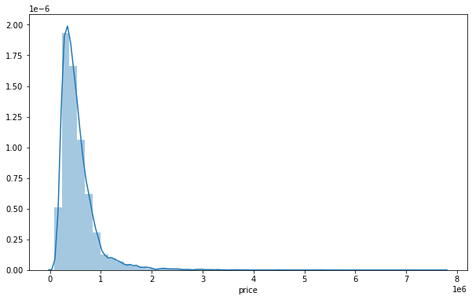
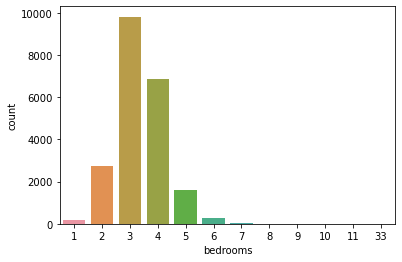
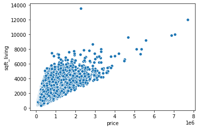
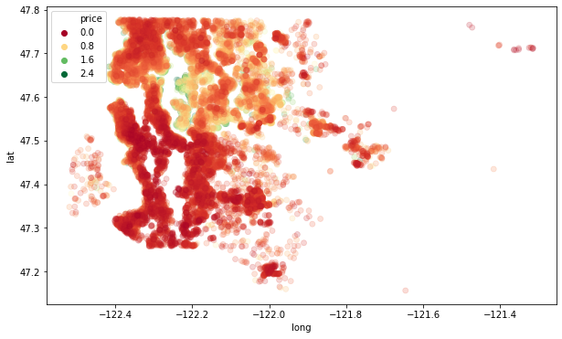
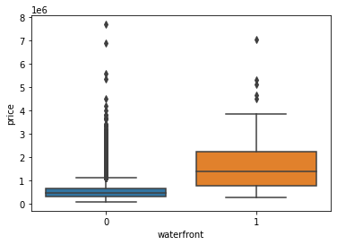
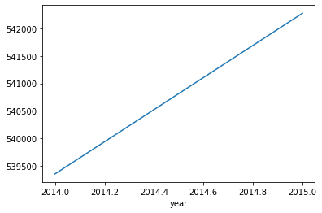

# HOUSE-PRICE-PREDICTION

**AIM**

This project is about Predicting the price of a house based on their features (no of bedrooms, no of bathrooms, square footage etc.) using a deep learning model. The goals of this project are:

•	Use of pandas, NumPy, matplotlib, & seaborn libraries from python to extract insights from the data.

•	Use of train test split function to split the dataset into two arrays input variable(X) and output variable (y).

•	Built a sequential model with dense layer for our Artificial Neural Network, and gave the number of neurons the same number of columns in our feature data.

•	Assigning rectified linear unit (RELU) as our activation function.

•	Compiling the model by using adam as the optimizer and mse as loss function.

•	Use of mean squared error, mean absolute error, explained variance score for evaluation since we are dealing with regression problem.

**FEATURED COLUMNS**

•	id - Unique ID for each home sold

•	date - Date of the home sale

•	price - Price of each home sold

•	bedrooms - Number of bedrooms

•	bathrooms - Number of bathrooms, where .5 accounts for a room with a toilet but no shower

•	sqft_living - Square footage of the apartments interior living space

•	sqft_lot - Square footage of the land space

•	floors - Number of floors

•	waterfront - A dummy variable for whether the apartment was overlooking the waterfront or not

•	view - An index from 0 to 4 of how good the view of the property was

•	condition - An index from 1 to 5 on the condition of the apartment,

•	grade - An index from 1 to 13, where 1-3 falls short of building construction and design, 7 has an average level of construction and design, and 11-13 have a high quality level of construction and design.

•	sqft_above - The square footage of the interior housing space that is above ground level

•	sqft_basement - The square footage of the interior housing space that is below ground level

•	yr_built - The year the house was initially built

•	yr_renovated - The year of the house’s last renovation

•	zipcode - What zipcode area the house is in

•	lat - Lattitude

•	long - Longitude

•	sqft_living15 - The square footage of interior housing living space for the nearest 15 neighbors

•	sqft_lot15 - The square footage of the land lots of the nearest 15 neighbours.

**APPROACH**

1.	Exploratory Data Analysis: Used summary statistics and graphical representations to discover patterns or correlation among the variables in the data.
2.	Feature engineering: Dropping unnecessary or repetitive features, dropping or filling any missing data etc.
3.	Model Creation and Training: Built a sequential model to train the input (X) and output (y) variables.
4.	Evaluating Model Performance: used mean squared error, mean absolute error and explained variance score to evaluate our model.

**MAJOR OBSERVATION FROM THE DATA**

•	Used seaborn’s distribution plot to visualize the price feature (since it’s a continuous label) which showed that the house prices mostly fall between 0-1.5 million dollars and some outliers for the extremely expensive houses.

•	used a count plot to visualize the most common number of rooms in most houses in the data which is usually has (between 2-5)

•	Explored more on the data’s highly correlated features using a scatterplot for e.g. house price and living space, and this showed the more the living space, the more the house price.

•	Temporarily dropped some outliers in the data by removing the top 1 percent of the most expensive houses I.e they are the house prices with 1 or 2 frequency in the data, In order to Use a scatter plot to show the relation between the house price and the latitude and longitudes of the house. This helped reveal the locations with the most expensive house prices.

•	A box plot was used to show the price difference between houses located at the waterfront and houses not located at the waterfront.

•	Did a plot on the average price of the houses as the year goes by, and this revealed that the house prices generally increase yearly.

